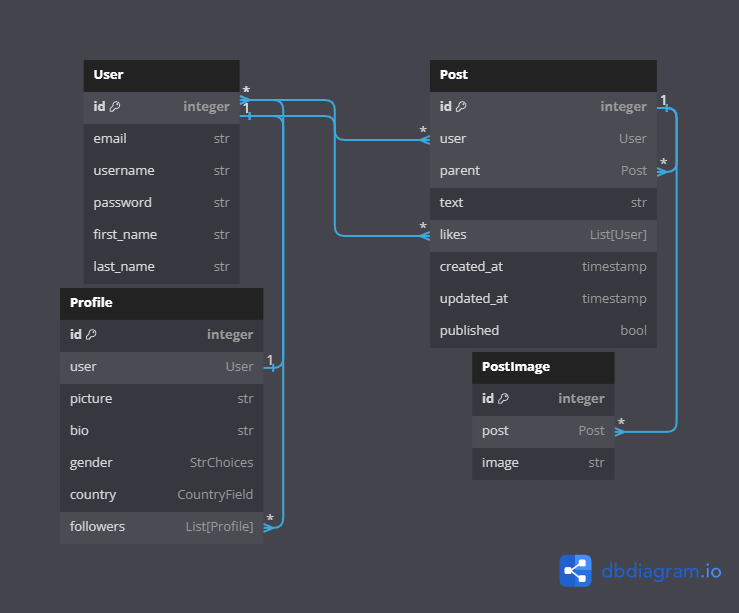

# Social Media API
REST API service for a social media platform

Built using `Django REST Framework` & `Celery`

## Features
- JWT Authentication
- View user profiles and posts
- Follow users to see their posts on your timeline
- Ability to create scheduled posts
- Likes & replies
- Search & filter
- Documented using DRF Spectacular

## Getting Started

*Rename `.env.sample` to `.env` and update environment variables accordingly*

```shell
# clone the repo
git clone https://github.com/Esxoyne/social-media-api.git
cd social-media-api

# build & run the container
docker-compose up

# create a super user
docker-compose exec web python manage.py createsuperuser
```

## DB Diagram


